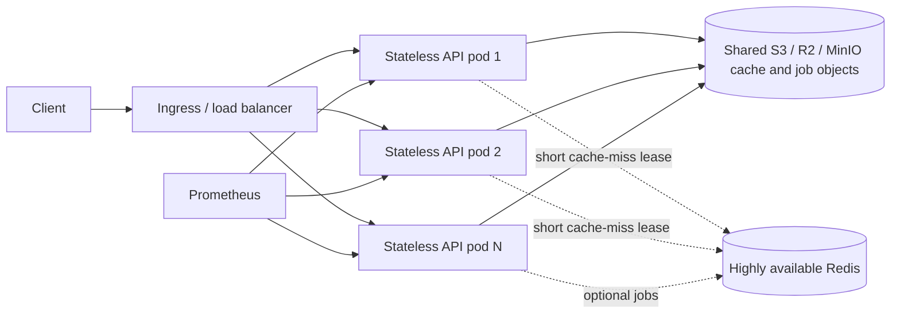

# Horizontal scaling

The HTTP API is designed so requests can move between replicas without sticky sessions. Each node owns its Fastify process, Sharp worker pool, concurrency limiter, and small local metrics registry. Persisted transform cache entries and batch input/output objects must live in a shared S3-compatible bucket; the disk adapter is single-node and ephemeral. Redis supplies optional cross-node cache-miss locks and BullMQ state when batch jobs are enabled.



## Cache misses across replicas

Per-process single-flight coalesces concurrent requests on one node. Set `CACHE_DISTRIBUTED_LOCK_ENABLED=true` and point `REDIS_URL` at a shared Redis service to coalesce the same cache miss across nodes. A node acquires `SET key token NX PX ttl`; lock keys are SHA-256 digests, release and lease renewal compare the random token in Lua, and the lease is renewed while a transform runs. Other nodes poll shared storage briefly and return the stored result. The default lease is 10 seconds and request wait is 15 seconds. On Redis failure, requests fail open and transform normally. If the lock wait expires or the owner dies, another node may compute the transform; storage remains correct, while duplicate work is bounded by the lease and request timeout.

The cache lock only coordinates cacheable transforms. Metadata-only operations and plugin operations marked non-cacheable do not hold distributed locks. Keep S3 object TTL at least as long as cache max-age. Redis must be shared by all replicas and configured with authentication/TLS and a suitable availability policy. Do not use a per-pod Redis instance.

## Kubernetes and HPA

The Helm chart defaults to two replicas. Enable its CPU and memory HPA with:

```yaml
autoscaling:
  enabled: true
  minReplicas: 2
  maxReplicas: 20
  targetCPUUtilizationPercentage: 70
  targetMemoryUtilizationPercentage: 80
```

Install with a pre-created Kubernetes Secret containing S3 access credentials and `REDIS_URL`:

```sh
helm upgrade --install images ./deploy/helm/image-craft-service \
  --set autoscaling.enabled=true \
  --set image.tag=<immutable-tag>
```

The chart references `image-craft-secrets` by default; configure `existingSecret` and `redis.existingSecret` if names differ. `REDIS_URL` is read from that secret. Metrics Server must be installed for CPU/memory HPA metrics. Requests/limits are defined in chart values; tune them with the load-test procedure rather than increasing replicas to compensate for undersized pods.

Use a topology spread constraint or pod anti-affinity in production so replicas land across nodes/zones. Set readiness/liveness probes and a termination grace period; the service closes its HTTP server and drains active workers on SIGTERM. Deploy at least two replicas before enabling autoscaling.

## Consistent-hash routing

Sticky routing is not required for correctness or cache hits. Use it only when it helps reduce duplicate cold work or improves connection locality. Hash the normalized transform identity: source URL without credentials, canonical ops, output format, and `Accept` when format negotiation is `auto`. Never hash API keys, signed tokens, or secrets. Hashing raw `$request_uri` is only an approximation: equivalent operation parameter orderings may go to different pods, and query/signature changes may rebalance them. Keep shared S3 and Redis as the source of truth.

For NGINX Ingress, a starting point is:

```yaml
metadata:
  annotations:
    nginx.ingress.kubernetes.io/upstream-hash-by: "$request_uri$http_accept"
```

Treat that annotation as URI-level affinity, not canonical cache-key routing. Verify the exact ingress controller supports consistent hashing, and measure before keeping it: adding/removing pods remaps some keys and may temporarily lower cache locality.

## Capacity and failure boundaries

- Each pod has independent CPU/memory limits and Sharp concurrency. Set the replica count to keep per-pod queueing and memory below limits.
- Use S3 lifecycle policies to remove expired cache and batch objects; S3 cache stats may require listing the bucket and can become expensive at large object counts.
- Use managed Redis or a replicated Redis deployment. Redis failure disables cross-node stampede protection; if BullMQ is enabled, it also affects job availability.
- Prometheus metrics are process-local. Scrape every pod using pod discovery; dashboards should aggregate counters with `sum` and calculate rates over time.
- HPA scales on CPU/memory, not cache miss latency or queue depth. Add KEDA or a custom metrics adapter if queue-driven scaling is required.
